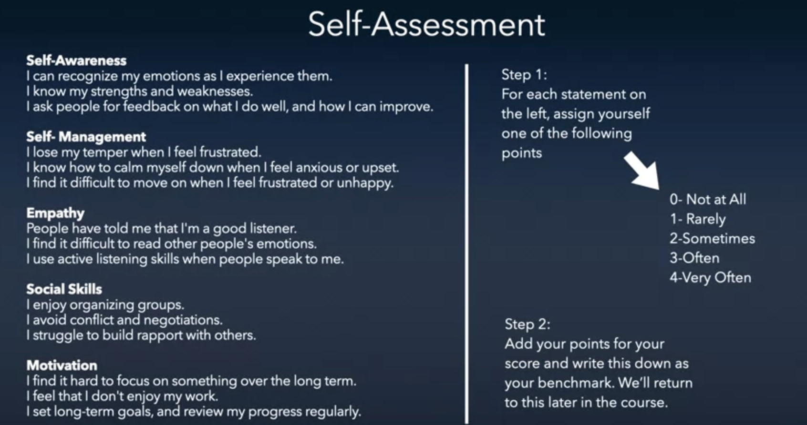

# Emotional Intelligence: Cultivating Immensely Human Interactions

"Experts" (think they) know; wise experts want to learn.  Wisdom is about humble curiosity and learning.  If we want to change, we are able to change.

---

> Emotions are a defining feature of the human condition; they structure our social relationships and imbue our lives with meaning and purpose.
>
-[Gerben Van Kleef, Emotions Scholar](https://van-kleef.socialpsychology.org/)

## 7 Essential Questions

1. Do emotions have a place at work?  Is it possible to be more emotionally attuned and professional at the same time?
2. How can knowing more about ourselves help us and help our connections with others?
3. How can emotions help us become wiser?
4. How can we manage our social-emotions to increase resiliency?
5. What is lost when we rely on the spoken word?  Is it possible to to have efficient communication relying only on the spoken word?  What does research say about the ways in which we can gather much more information from the social context and be that more effective by being more emotionally intelligent?
6. What is lost when you read the emotions of a person but not the collective?  What does it take to work in a team or to be a leader and really understand the importance of seeing the forest, not just a tree?  What is gained when you shift your focus from a person to people?
7. What do transformative mentors and lasting legacies have in common?

## Lesson 1: Do emotions have a place at work?

There's a competitive advantage of leveraging our deeply human abilities at social interaction.

> In business, we try to **pretend** that emotions don't exist, to try to be completely unemotional and rational, which is a **fiction**.  Without Emotions you actually can't make a decision, because you make your decisions based on what you care about."
>
-[Chris Voss, Former lead FBI negotiator](https://en.wikipedia.org/wiki/Christopher_Voss)

When you have more mixed feelings as opposed to simply being optimistic or pessimistic for example, you're able to make better use of complex and conflicting information. That's exactly what's needed when you're making decisions under uncertainty and in complex situations.

### A Practical Model of Social-Emotional Intelligence

The yellow part of the model is focused on "you."  How do we "grow" what we know about ourselves?

* Known parts of ourselves can be improved upon with reflection and self-analysis
* Unknown parts of ourselves can be improved upon with feedback from others

When you are aware of your own behaviors and you decide to do a behavior more or less, if you can, a next step to go even deeper might be to ask someone, someone you trust to be your partner in change. Ask them to watch you and give you feedback as to how you're doing with your goal.

### The Paradox of Acting "Professional"

Social-emotional intelligence is *not* fixed, it can be improved (but it can also go unused).  Whether or not social-emotional intelligence will be leveraged depends on your leadership and the organization's culture.  Relationship conflict is particularly problematic, this is an obvious blindspot in the US.

> All grown-ups were once children, but only few of them remember it.
>
-[Antoine de Saint-Exupéry, 1943](https://en.wikipedia.org/wiki/Antoine_de_Saint-Exup%C3%A9ry)

Walt Disney designed the theme park from the perspective of a child.  For example, when we first enter the theme park there's buildings to the left and right, and the 2nd and 3rd stories of the buildings don't appear realistic from an adult's perspective, but they do look real from a child's perspective.  This speaks to the challenge of trying to understand other's perspectives when we have a hard time seeing our own life's previous perspectives.

### The Accuracy of First Impressions

This brief reflection article discusses research on how it’s possible when we are attuned, to be remarkably accurate in reading other people. There is a link within this article that we encourage you to read. The issues discussed here raise implications for how you should manage your own non-verbal signals and how you can gather rich information about others through paying attention: https://bobsutton.typepad.com/my_weblog/2009/07/the-accuracy-of-first-impressions-an-amazing-old-study-about-thin-slices-of-behavior.html

### Self-Assessment: How Emotionally Intelligent Are You?

* https://www.mindtools.com/pages/article/ei-quiz.htm

#### What will being more self-aware do for us?

* increase productivity, creativity, self-esteem, self-confidence, and communication
* boose acceptance by others
* encourage positive self-development
* improvde self-control, decision making, job performance, job related well-being
* allows self-pride which in term enhances self-esteem

### The Case for Mindful Engagement

People moving into new leadership roles often find themselves overwhelmed with demands on their time, higher expectations, and intense ambiguity and change.  So it might seem hard to justify carving out time to reflect -- to step back and think about what they’ve learned, and what they might do differently next time.

> In a challenging and complex situation, people tend to develop a performance-based mindset that can undermine their personal and professional growth.

Research shows the key to professional growth is treating yourself like an R&D engine. How do you become a R&D engine? You embrace a learning mindset where mistakes are opportunities to learn. You have a laser-like focus on learning goals. You create experiments for yourself, seek feedback, adapt, and then repeat.  And you reflect on success and failure.

* https://michiganross.umich.edu/rtia-articles/case-mindful-engagement

One of the first steps is learning how and when to take a step back from the daily grind and just think. The trick is to make it a habit.
